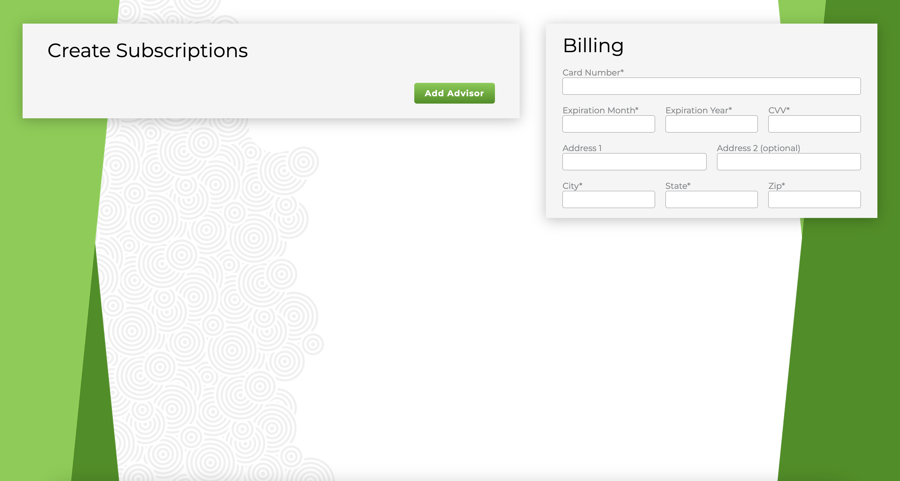
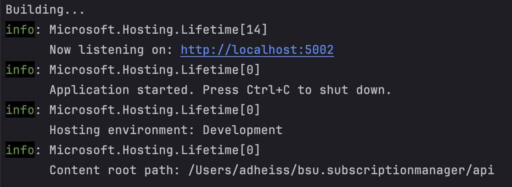
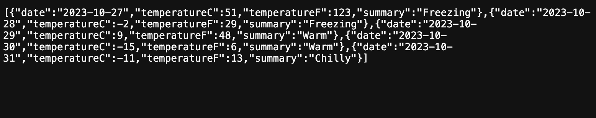

# Development
## Tech Aspects
- Frontend: Vue 3 with TypeScript
- Backend: .NET 7.0 with C#
- Bitbucket for version control

## Vue Folder Structure
- src has the main code
- src/views contains the pages for the site, including the typescript, scss, and html in each .vue file.
- src/components ontains vue code for individual components for the pages, such as the InputGroup, AdvisorsSection, ect.
- src/assets contains images and other assets for the site.
- src/services contains the code for the api calls to the backend.
- src/types contains the typescript types.
- src/stores contains the pinia stores.
- src/validators contains the zod schema validators.
- package.json contains the dependencies for the project and scripts that can be run for the project.
## FRONTEND

### Installing Pre-requisites
- Install NodeJS (v20.9.0 recommended)
    - [Node Download](https://nodejs.org/en)

### Installing Dependencies
- Run `npm install` in the frontend directory

### Reccomended IDE Setup
#### Plugins
- [VS Code](https://code.visualstudio.com/) + [Volar](https://marketplace.visualstudio.com/items?itemName=Vue.volar) (and disable Vetur) + [TypeScript Vue Plugin (Volar)](https://marketplace.visualstudio.com/items?itemName=Vue.vscode-typescript-vue-plugin).

### Running the Frontend Locally
- Run `npm run dev` in the frontend directory
  
- Navigate to the outputted URL in your browser
- You should see the following page
  

### Linting and Formatting
- Linting and Formatting is done with ESLint and Prettier using the Accutech specific configuration
- Run `npm run lint` in the frontend directory to lint the code
- Run `npm run lint:fix` in the frontend directory to fix linting errors
- Run `npm run format` in the frontend directory to format the code
- Linting guidelines can be found in the `.eslintrc` file in the frontend directory
- Formatting guidelines can be found in the `.prettierrc.json` file in the frontend directory

## BACKEND

### Installing Pre-requisites
- Install .NET 7.0
    - [Download .NET](https://dotnet.microsoft.com/en-us/download)

### Reccommended IDE Setup
- [Visual Studio Code](https://code.visualstudio.com/)
#### Plugins
- [C# Dev Kit](https://marketplace.visualstudio.com/items?itemName=ms-dotnettools.csdevkit)
### Running the Backend Locally
- Run `dotnet run` in the backend directory
  

- Navigate to the outputted URL in your browser withe the /weatherforecast endpoint
- You should see the following page
  