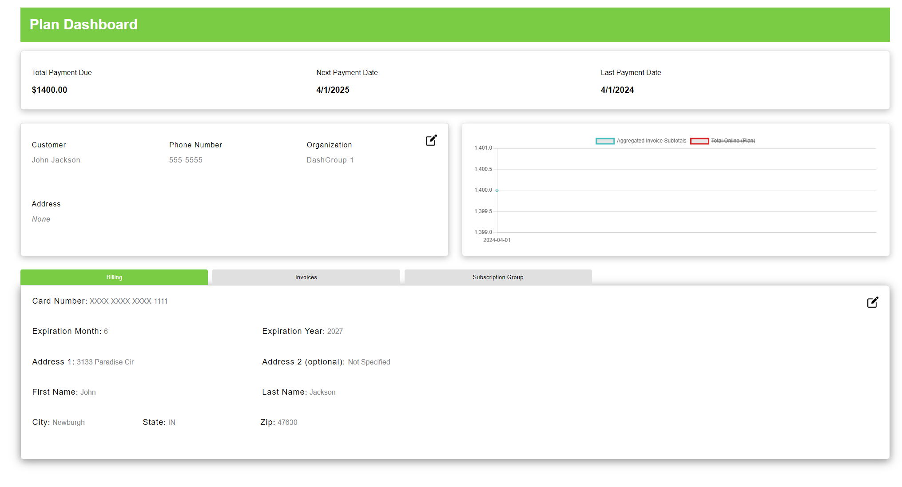

# Development

## Tech Aspects

- Frontend: Vue 3 with TypeScript
- Backend: .NET 7.0 with C#
- Bitbucket for version control

## Vue Folder Structure

- src has the main code
- src/views contains the pages for the site, including the typescript, scss, and html in each .vue file.
- src/components ontains vue code for individual components for the pages, such as the InputGroup, AdvisorsSection, ect.
- src/assets contains images and other assets for the site.
- src/services contains the code for the api calls to the backend.
- src/types contains the typescript types.
- src/stores contains the pinia stores.
- src/validators contains the zod schema validators.
- package.json contains the dependencies for the project and scripts that can be run for the project.

## FRONTEND

### Installing Pre-requisites

- Install NodeJS (v20.9.0 recommended)
  - [Node Download](https://nodejs.org/en)

### Installing Dependencies

- Run `npm install` in the frontend directory

### Reccomended IDE Setup

#### Plugins

- [VS Code](https://code.visualstudio.com/) + [Volar](https://marketplace.visualstudio.com/items?itemName=Vue.volar) (and disable Vetur) + [TypeScript Vue Plugin (Volar)](https://marketplace.visualstudio.com/items?itemName=Vue.vscode-typescript-vue-plugin).

### Running the Bulk Signup Frontend Locally

- Clone the code from: https://bitbucket.org/accutechcapstone/bsu.subscriptionmanager/src/master/
- master has the latest release code, dev has the latest development code. You probably will want to check out dev.
- In a terminal, navigate to the project directory. At the top level, run 'cd bulk-signup'
- Run `npm install`
- Once installation is finished, run `npm run dev` in the bulk-signup directory
  
- Navigate to the outputted Local URL in your browser
- You should see the following page
  

### Running the Subscription Manager Dashboards Frontend Locally

- The Subscription Manager Dashboard is broken up into multiple directories. It is a monorepo. The top level is the directory "dashboards" which inside is "packages." In there are the various monorepo directories. It contains the following directories:
  - Inside apps:
    - advise-dashboard
    - plan-dashboard
    - merit-dashboard
  - Inside libs:
    - shared-api-utils
    - shared-stores
    - shared-components
    - shared-types
- Assuming you have already cloned the code and checked out dev, navigate to the project directory in a terminal. At the top level, run `cd dashboards`
- Once there you will need to make sure you have run `npm install` and `npm i --workspaces`
- After installation is complete, you will need to build each package individually.
- When making changes you will also need to rebuild the directory you made changes in. To build them, you would navigate to the directory's `package.json`.
- In the `package.json` you will see "scripts". Depending on which directory you are in, there maybe just a build script, or both a dev and build script. Something like this:
  
- Hovering over one of them will give you the option to run the script. Running build will build your changes. Running the dev script will run that dashboard, as only the dashboards have the option to run dev.
- These are the same as running the commands `npm run build` or `npm run dev`
- After freshly cloning the repo and running `npm install` and `npm i --workspaces`, you will want to build the packages in this order:
  - shared-types
  - shared-api-utils
  - shared-stores
  - shared-components
  - Now, any dashboard can be built
- Once these packages all build, can you run dev in any of the dashboards. After running dev, navigate to one of the outputted Local URL in your browser
- Make sure the API/backend is running so that information will populate the dashboards
- You should see a page that looks something like this (its looks may vary depending on which dashboard is run):
  

### Potential issues

- Building certain directories before others could cause issues
- If an attempt is made to build a directory which is dependent on another directory having its changes built already, the build will fail
- For example, trying to build the plan dashboard, which is reliant on invoice table component in shared-components, will result in failure and/or issues if the shared-component package has not been built
- The dashboard may run but be out of date because of the out of date build in another package, or it may simply have a build failure
- To fix this simply clean up the error and/or rebuild the directory containing the error. Then run the original directory you were trying to build
- If all else fails, try building every package in the order listed above

### Linting and Formatting

- Linting and Formatting is done with ESLint and Prettier using the Accutech specific configuration
- Run `npm run lint` in the frontend directory to lint the code
- Run `npm run lint:fix` in the frontend directory to fix linting errors
- Run `npm run format` in the frontend directory to format the code
- Linting guidelines can be found in the `.eslintrc` file in the frontend directory
- Formatting guidelines can be found in the `.prettierrc.json` file in the frontend directory

## BACKEND

### Installing Pre-requisites

- Install .NET 7.0
  - [Download .NET](https://dotnet.microsoft.com/en-us/download)

### Reccommended IDE Setup

- [Visual Studio Code](https://code.visualstudio.com/)

#### Plugins

- [C# Dev Kit](https://marketplace.visualstudio.com/items?itemName=ms-dotnettools.csdevkit)

### Running the Backend Locally

- In a terminal, navigate to the top level of the project directory. Once there, run `cd api` and then `cd SubscriptionManagerAPI`
- Run `dotnet run` in the SubscriptionManagerAPI directory
- The output should look something like this:
  

- Once the backend is running, you will be able to submit a bulk signup subscription request to Maxio, be able to view/edit info on the dasboard, and submit an onboarding request
- This alert will also display on the front end when succesfully creating a new subscription:
- 

## Replicating via Docker

- Run `docker compose up` in the root level of the project directory
- If this is the first time running the project, it will take a while to download the images and build the containers
- If you have built the containers before and have new npm packages run `docker compose up --build` to rebuild the containers
- You should see something like the following output in the terminal:
  
- The api will be running on port `5002`
- The bulk sign up frontend will be running on port `5173`
- The advise dashboard frontend will be running on port `5174`
- The merit dashboard frontend will be running on port `5175`
- The plan dashboard frontend will be running on port `5176`

### Docker Subscription Manager Dashboards
- Docker will handle the installation of packages for the dashboards, but you still have to manually build the packages for your local changes to take effect
- Run `npm run build --ws` in the dashboards directory for your package changes to apply to the docker container

### Running Onboarding
- Run `npm i` in the onboarding directory if you haven't yet
- In the onboarding directory run `npm run dev` or `vite`
- It will run on the next available port
- You should see a page that looks like this

