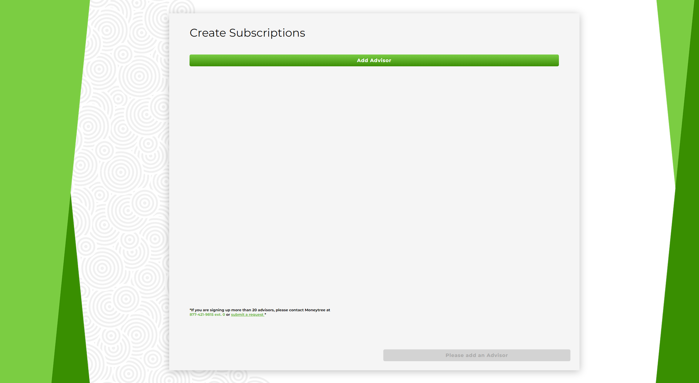
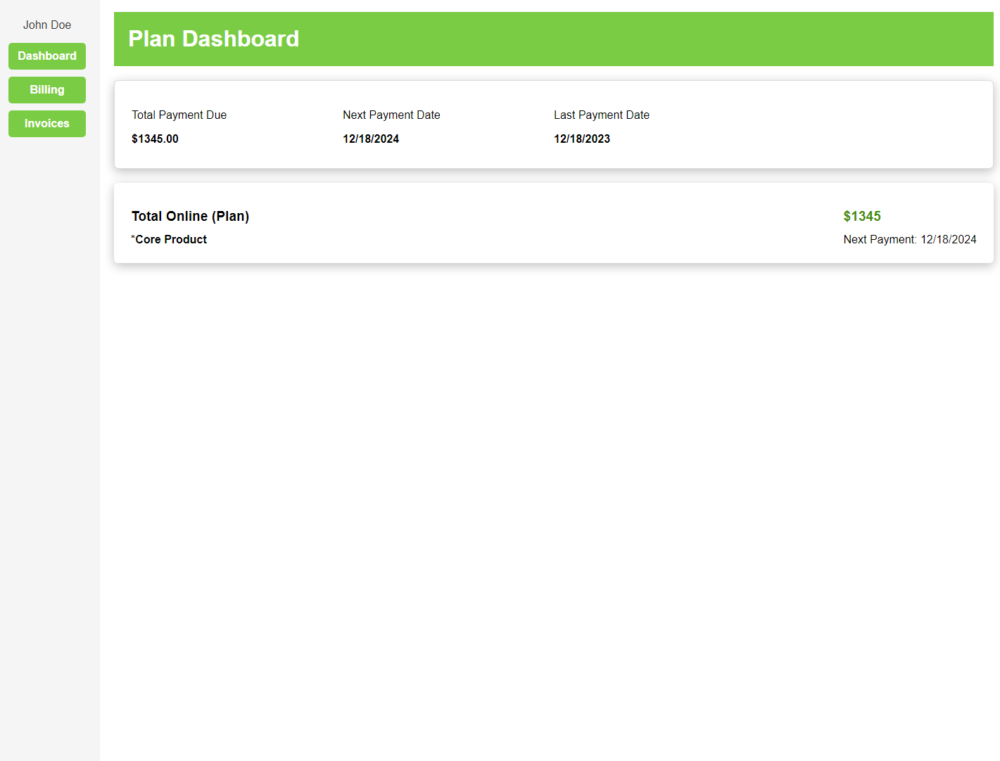

# Development

## Tech Aspects

- Frontend: Vue 3 with TypeScript
- Backend: .NET 7.0 with C#
- Bitbucket for version control

## Vue Folder Structure

- src has the main code
- src/views contains the pages for the site, including the typescript, scss, and html in each .vue file.
- src/components ontains vue code for individual components for the pages, such as the InputGroup, AdvisorsSection, ect.
- src/assets contains images and other assets for the site.
- src/services contains the code for the api calls to the backend.
- src/types contains the typescript types.
- src/stores contains the pinia stores.
- src/validators contains the zod schema validators.
- package.json contains the dependencies for the project and scripts that can be run for the project.

## FRONTEND

### Installing Pre-requisites

- Install NodeJS (v20.9.0 recommended)
  - [Node Download](https://nodejs.org/en)

### Installing Dependencies

- Run `npm install` in the frontend directory

### Reccomended IDE Setup

#### Plugins

- [VS Code](https://code.visualstudio.com/) + [Volar](https://marketplace.visualstudio.com/items?itemName=Vue.volar) (and disable Vetur) + [TypeScript Vue Plugin (Volar)](https://marketplace.visualstudio.com/items?itemName=Vue.vscode-typescript-vue-plugin).

### Running the Bulk Signup Frontend Locally

- Clone the code from: https://bitbucket.org/accutechcapstone/bsu.subscriptionmanager/src/master/
- master has the latest release code, dev has the latest development code. You probably will want to check out dev.
- In a terminal, navigate to the project directory. At the top level, run 'cd bulk-signup'
- Run `npm run dev` in the bulk-signup directory
  
- Navigate to the outputted Local URL in your browser
- You should see the following page
  

### Running the Subscription Manager Dashboards Frontend Locally

- The Subscription Manager Dashboard is broken up into multiple directories. It is a monorepo. The top level is the directory "dashboards" which inside is "packages." In there are the various monorepo directories. It contains the following directories:
  - advise-dashboard
  - plan-dashboard
  - merit-dashboard
  - shared-api-utils
  - shared-stores
  - subscription-dashboard-component-library
- Assuming you have already cloned the code and checked out dev, navigate to the project directory in a terminal. At the top level, run `cd dashboards`
- Once there you will need to make sure you have run `npm i --workspaces`
- After installation is complete, you have a couple of options. You can either build/run each directory individually, depending on where you make changes, or run all at once.
- When making changes it is preferable to just build the directory you made changes in. To do this, you would navigate to the directory's `package.json`.
- In the `package.json` you will see "scripts". Depending on which directory you are in, there maybe just a build script, or both a dev and build script. Something like this:
  
- Hovering over one of them will give you the option to run the script. Running build will build your changes. Running the dev script will run that dashboard, as only the dashboards have the option to run dev.
- Thes are the same as running the commands `npm run build` or `npm run dev`
  &nbsp;
- Now, if you wanted to do all of this at once you would do as follows.
- Run `npm run build --workspaces` in `dashboards` to build all of the projects in the monorepo
- Once complete, run `npm run dev --workspaces` to run all the projects in the monorepo
  &nbsp;
- After running dev either of these ways, navigate to one of the outputted Local URL in your browser
- Make sure the API/backend ([link](### Running the Backend Locally)) so that information will populate the dashboards
- You should see a page that looks something like this (its looks may vary depending on which dashboard is run):
  

### Potential issues

- Building certain directories before others could cause issues
- This is common when running the command to build all directories
- If an attempt is made to build a directory which is dependent on another directory having its changes built already, the build will fail
- For example, trying to build the plan dashboard, which includes the invoice table component, which still has errors because it hasn't been built, will also cause the plan dashboard build to fail
- To fix this simply clean up the error and/or rebuild the directory containing the error. Then run the original directory you were trying to build
- Most of the time, simply running `npm run build --workspaces` twice will fix any issues. The first time it runs there maybe build errors, but other builds will complete. The second time, the build errors will go away because of the builds that completed the previous time the command ran

### Linting and Formatting

- Linting and Formatting is done with ESLint and Prettier using the Accutech specific configuration
- Run `npm run lint` in the frontend directory to lint the code
- Run `npm run lint:fix` in the frontend directory to fix linting errors
- Run `npm run format` in the frontend directory to format the code
- Linting guidelines can be found in the `.eslintrc` file in the frontend directory
- Formatting guidelines can be found in the `.prettierrc.json` file in the frontend directory

## BACKEND

### Installing Pre-requisites

- Install .NET 7.0
  - [Download .NET](https://dotnet.microsoft.com/en-us/download)

### Reccommended IDE Setup

- [Visual Studio Code](https://code.visualstudio.com/)

#### Plugins

- [C# Dev Kit](https://marketplace.visualstudio.com/items?itemName=ms-dotnettools.csdevkit)

### Running the Backend Locally

- In a terminal, navigate to the top level of the project directory. Once there, run 'cd api'
- Run `dotnet run` in the api directory
- The output should look something like this:
  

- Once the backend is running, you will be able to submit a bulk signup subscription request to Maxio
- A successfull susbcription creation will look something like this in the terminal:
  
- This alert will also display on the front end:
- 

## Replicating via Docker

- Run `docker compose up` in the root level of the project directory
- If this is the first time running the project, it will take a while to download the images and build the containers
- If you have built the containers before and have new npm packages run `docker compose up --build` to rebuild the containers
- You should see the following output in the terminal:
  
- The api will be running on port `5002`
- The bulk sign up frontend will be running on port `5173`
- The subscription manager frontend will be running on port `5174`
