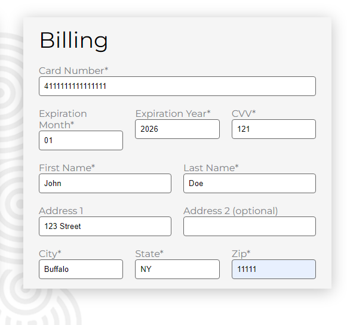
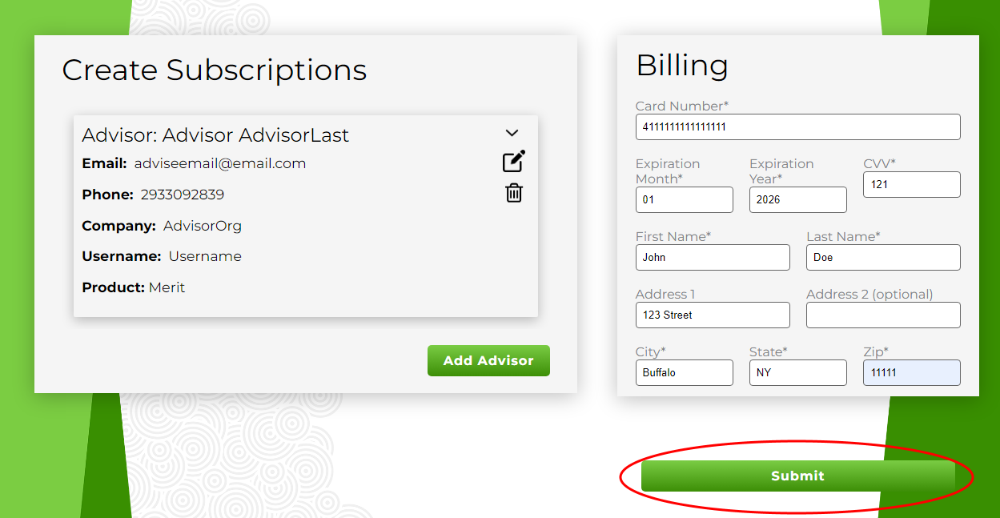
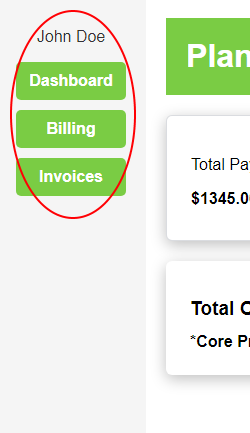
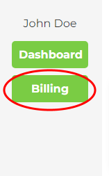
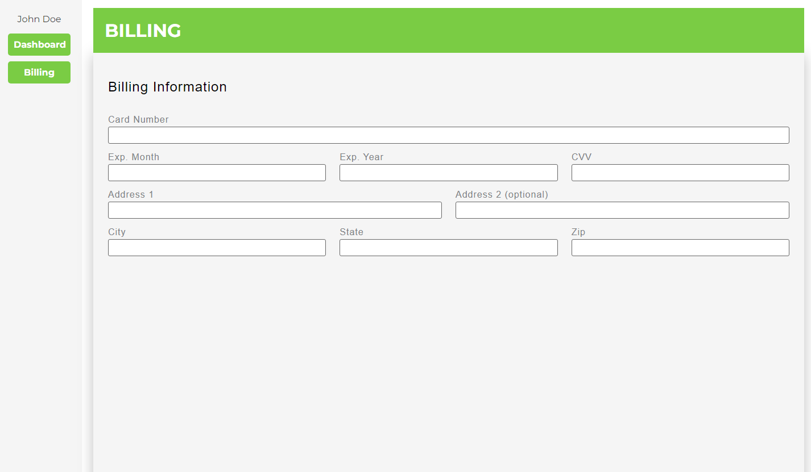
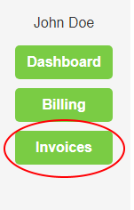
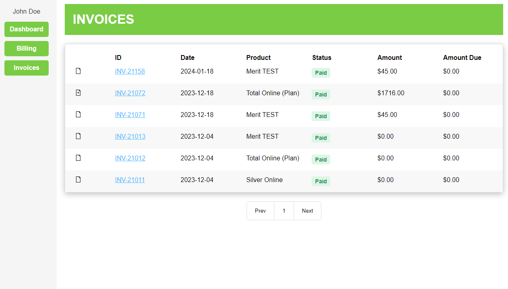
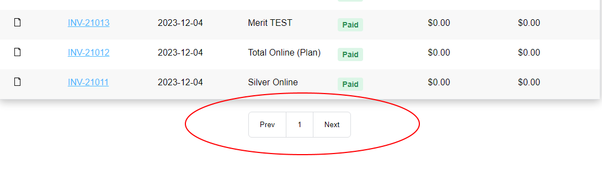

# User

This file will guide use on both Bulk Signup and Subscription Manager Dashboard

# Bulk Signup

## Step 1:

- Navigate to the Create Advisor page
  

## Step 2:

Once at advisor page, you can create advisors like so:

- Click the add advisor button circled in red
  
- Once you have clicked the add advisor button, a new page will open
  

## Step 3:

- Input the advisor information
- Choose your core product
- If chose Moneytree Plan or Moneytree Advise: choose an additonal product of Account Aggregation if needed
  
- If you chose Merit: Pick a Merit Username
  
- Once Advisor information is added, you may click add advisor to add an advisor with this information
  
- If you would like to cancel this information, click cancel
  

## Step 4:

If need to edit the added advisor information, you may do the following:

- Click the arrow circled in red to pull down the information of an advisor
- Click the circled blue edit button to edit any changes to an advisor's information
- Click the circled green delete button to delete any advisors information
  

## Step 5:

Once you have the advisors you want to add, navigate towards the billing section

- Input the billing information
- This billing information will be used for all advisors you have added
- If incorrect billing information is provided, e.g. a short card number, it will require you to provide correct billing information.

## Step 6:

Once billing information is filled out, navigate towards the Submit button to submit this advisor information and billing information.

Once you have pressed submit, the information will be sent to Maxio to create subscriptions..

# Subscription Manager Dashboard

## Step 1:

- You will begin in the main dashboard for the Subscription Manager
- It should look something like this:
  
- Depending on what subscriptions the customer is signed in under, different information may show or the layout/colors may differ slightly
- Notice the different panels in the side bar:
- 

## Step 2:

- Clicking on Billing will take you to the billing information page of the Subscription Manager:
- 
- The page looks like this:
  
- Nothing currently can be done here, besides typing in information. But it can't be submitted.

## Step 3:

- Clicking on Invoices will take you to the billing information page of the Subscription Manager:
- 
- The page looks like this:
  
- This shows the invoices for the logged in customer. It is not just for the product subscription that is logged in under. It is all of their invoices for everything they have had an invoice for.
- There are buttons at the bottom of the page. Each page contains 10 invoices. If there are more than 10, say 11 for example, then there would be 2 pages. In this screenshot there is only one page, but they look like this
  
- The buttons are pretty self explanatory, they simply take you to the corresponding page of invoices. Prev and Next take you to the prior or following page of invoices respectively.
