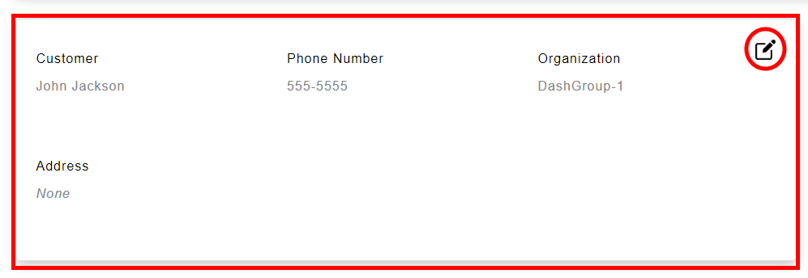
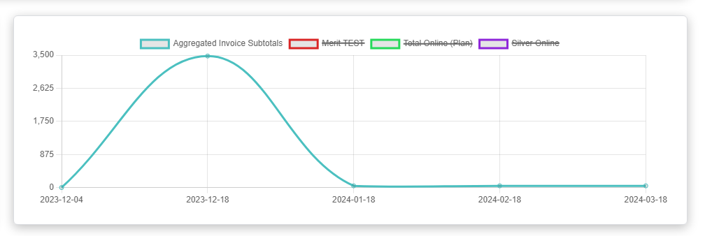
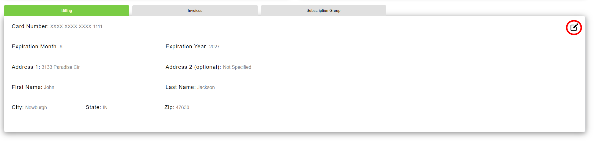

# User

This file will guide use on both Bulk Signup, Subscription Manager Dashboard, and Onboarding

# Bulk Signup

## Step 1:

- You begin in the create subscriptions step
  

## Step 2:

Once at advisor page, you can create advisors like so:

- Click the add advisor button circled in red
  
- Once you have clicked the add advisor button, a new page will open
  

## Step 3:

- Input the advisor information
- Choose your core product
- If chose Moneytree Plan or Moneytree Advise: choose an additonal product of Account Aggregation if needed
  
- If you chose Merit: Pick a Merit Username
  
- Once Advisor information is added, you may click add advisor to add an advisor with this information
  
- If you would like to cancel this information, click cancel
  

## Step 4:

If need to edit the added advisor information, you may do the following:

- Click the arrow circled in red to pull down the information of an advisor
- Click the circled blue edit button to edit any changes to an advisor's information
- Click the circled green delete button to delete any advisors information
  

## Step 5:

Once you have the advisors you want to add, click the next button to go to the next step, billing

You will see this:

- Input the billing information
- This billing information will be used for all advisors you have added
- If incorrect billing information is provided, e.g. a short card number, it will require you to provide correct billing information.

## Step 6:

Once billing information is filled out, navigate towards the Submit button to submit this advisor information and billing information. 

Note that you can click on the Previous button to go back to the create subscriptions page
Once you have pressed submit, the information will be sent to Maxio to create subscriptions..

# Subscription Manager Dashboard

## Step 1:

- You will begin in the main dashboard for the Subscription Manager
- It should look something like this:
  
- Depending on what subscriptions the customer is signed in under, different information may show or the layout/colors may differ slightly
- All different functionality options are available on this single dashboard

## Step 2:
- You can view subscription information in the subscription card at the top of the dashboard, here:
  

## Step 3:
- In the customer information tab, you can view your personal information on your account. It looks like this, notice the edit button in the top right: 
  
- Clicking the edit button in the top right will bring up a modal. Here you can edit your personal information. Clicking the submit button will send the request to Maxio to update the information. Simply fill out the fields, and click submit, or click close to close the modal. It looks like this:
  

## Step 4:
- This chart is a chart that represents invoice subtotal amounts throughout the history of the account. It simply provides a more easily understandable view of this information for the customer. It looks like this:
  

## Step 5:
- Inside the tab switcher lives 2 sections, the billing section and invoices section.
- It starts on the billing tab, or you can return to it by clicking the billing tab again. You will see your personal billing information, including a masked card number. It will look like this, notice the edit button in the top right:
  
- Clicking the edit button will bring up a modal. Similar to the customer information modal, you can input new billing information and submit it, or close the modal using the corresponding buttons. It looks like this:
  

## Step 6:
- Clicking on Invoices will take you to the invoice table inside the invoice tab. It looks like this, notice the links and page numbers:
  
- Each page of the table includes up to 10 invoices. Buttons are disabled accordingly. In this instance, there are less than 10 invoices so all the buttons are disabled. If there were, say 15 invoices, there would be 2 page buttons plus 'prev' and 'next', and when on the initial page 1, the 'prev' button and '1' would be disabled.
- Clicking the invoice number link brings up a modal. This modal can include just a public url to the invoice, where it can be paid. It will only show a url if the invoice is a singular invoice, without any child segments. If the invoice is a parent invoice, i.e. they have child segments, a table will be inside the modal as well, showing those children segments. The modal can be closed using the 'close' button. It looks like this (this is a parent invoice with children segments):
  

# Onboarding
## Step 1:
- You will start on an account creation page. Enter the information asked for, there is validation for what is reuired. It looks like this (with validation errors), notice the steps at the top, and the 'next' button at the bottom:
  
- The steps at the top track your progress through the initial onboarding process, and the 'next' button takes you to the next step, as long as validation is met in the form.

## Step 2:
- You just click through each step, filling out requested information. The next step looks like this:
  
- Steps will look similar to these listed above.
- The 'previous' button takes you to the previous step.

## Step 3:
- The last step will have a submit button, currently there is no functionality to this:
  

