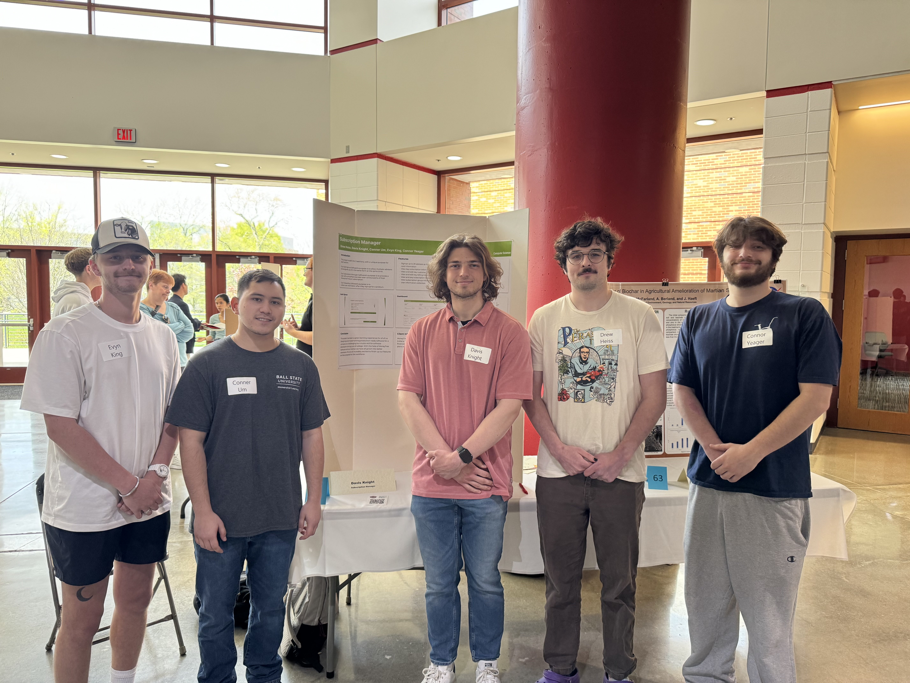

## 5 People Who Listened

Ashley Vanaman

Jack Carthew

Justyn Fox

Tia Self

Micah Harker

## Team Experience
Drew Heiss: The student symposium was interesting to experience. It was mainly standing around and boring but it was nice to talk about the project when people came up. It was cool to see other people’s work though some of the chemistry/bio ones were fascinating. Overall it was good experience to practice talking about our work.

Conner Um: I had a fun and interactive experience at the Student Symposium. We had many individuals interact with us that seemed genuinely interested in our presentation. Not only was it gratifying to present for others, it also allowed me to learn from other groups presenting. In terms of preparing, setting up and navigating for the symposium, it very easygoing and straightforward. Although it may have lasted longer than preferred, it was still an overall good experience.

Evyn King: The student symposium was super eye opening due to the fact that there were so many other projects outside of computer science projects. During our group’s presentations to judges and other students they seemed to be interested in our projects layout and functionality. On the other hand, walking around to see other projects was also interesting to me because we saw them all year but to see the final product of other groups and their progression through the year was super cool to me.

Davis Knight: I had a pretty good time at the student symposium. It was more or less what I expected, but I was pleasantly surprised with how many people came up to our poster. More than 10 listened, so I thought that was cool. I think that at a certain point things started to die down and it got a bit boring. It was also nice to get some more experience explaining our project to less technical people.

Connor Yeager: Student symposium was a great way to see what all the students of Ball State can do. Many different majors and projects. I saw some projects that were way out of my scope and it was really great to see a high level of intellect in respective majors. Judges were noticeable but they mostly pick and choose what they judge. We recieved some good judges but some of them are not very tech savvy so I don't if they understood the full scope of our own project. Overall it was a great experience.

## Team Picture

